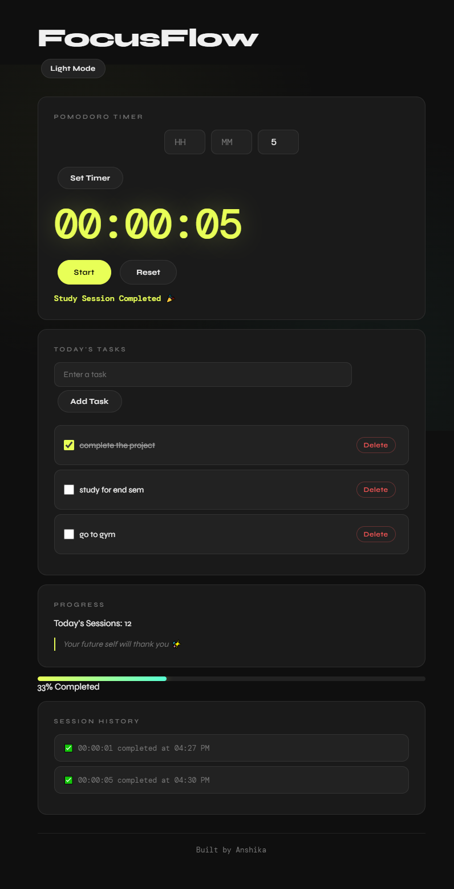
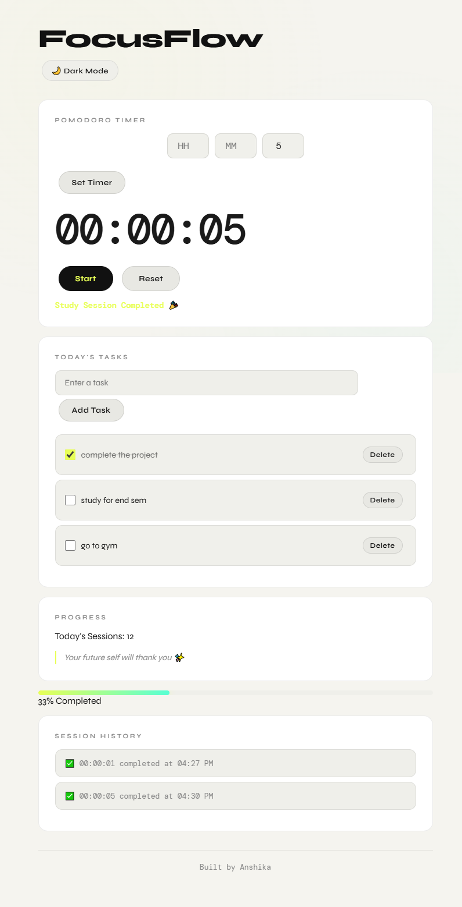

# FocusFlow 🎯

A clean, minimal productivity app to help you stay focused with 
Pomodoro-style timers, task tracking, and daily session history.

> Built because I needed a distraction-free study tool during exam prep.

## 🌙 Dark Mode

## ☀️ Light Mode

🔗 **Live Demo:** https://anshikashivhare274.github.io/focusflow/

## Features
- ⏱️ Customizable timer (hours, minutes, seconds)
- ✅ Task management with localStorage persistence
- 📊 Daily session tracking with progress bar
- 🕓 Session history log
- 💬 Motivational quotes on session complete
- 🌙 Dark / Light mode toggle
- 🔔 Sound notification on completion
- 📱 Fully responsive design

## Tech Stack
HTML · CSS · JavaScript · LocalStorage

## What I Learned
- Persisting data with localStorage across sessions
- Building responsive layouts with pure CSS
- Debugging timer state and cached data bugs
- Handling the browser Audio API

## Run Locally
git clone https://github.com/anshikashivhare274/focusflow.git
cd focusflow
open index.html

## Author
**Anshika Shivhare**
